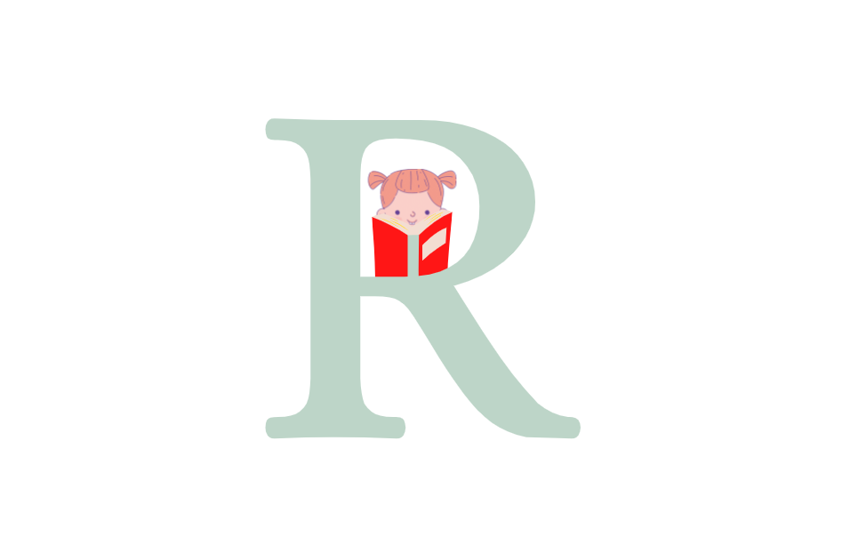

<h1 align="center">read me a story </h3>

  
  <a href="https://github.com/reemaowerdi/GP1">
    
  </a>

# Introduction:
  
“Read me a story” will focus on categorizing children's stories into defined topics like honesty, friendship, respect, brave, etc. Depending on the topic that the user wishes to address, "Read me a story" will apply a classifier model based on machine-learning algorithms to classify the stories. 

+# programming language: 

# launching instructions:

if you want to test new story :
The classifier_directory which contain the saved model is too large to upload in GitHub so if you would like to use it you can download it from google drive  https://drive.google.com/drive/folders/1-IqFcw-5lSQIbaZWPwkeFVDX2jF0Kp2Q?usp=sharing :

* open RoBERTa folder then open predict.ipynb 
* type the content of the story in X_test
* run the code from the start
* the moral will show 
or in  Visual Studio : 
*same steps but you shoild install libraries 

to add the story in the applicaton :
* open RoBERTa folder then open admin.py 
* run the code 
* for Windows write in terminal (python -m admin run) and for mac (python3 admin.py)
* the terminal will show that running on http://127.0.0.1:5000/ follow the link  

to run the appllication for mac: 
* you need to download Xcode , flutter and Visual Studio
* run main.dart 
